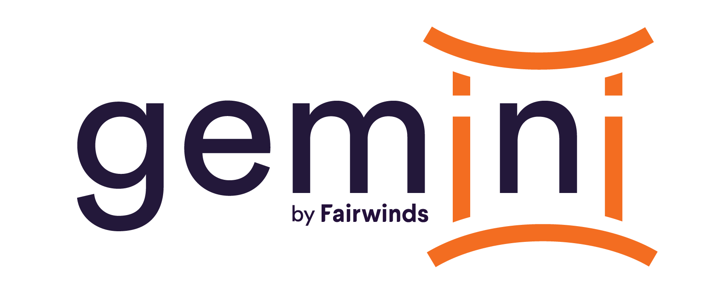

<div align="center">
<a href="https://github.com/FairwindsOps/gemini"></a>
<br>
</div>

## Intro

This is a Helm chart for the Fairwinds
[Gemini project](https://github.com/FairwindsOps/gemini).
It provides a Kubernetes CRD and operator for managing `VolumeSnapshots`, allowing you
to back up your `PersistentVolumes` on a regular schedule, retire old backups, and restore
backups with minimal downtime.

See the [Gemini README](https://github.com/FairwindsOps/gemini) for more information.

## Installation
```bash
helm repo add fairwinds-stable https://charts.fairwinds.com/stable
helm install gemini fairwinds-stable/gemini --namespace gemini
```
## Requirements

Your cluster must support the [VolumeSnapshot API](https://kubernetes.io/docs/concepts/storage/volume-snapshots/)

## Values

| Key | Type | Default | Description |
|-----|------|---------|-------------|
| image.pullPolicy | string | `"Always"` | imagePullPolicy - Highly recommended to leave this as `Always` |
| image.repository | string | `"quay.io/fairwinds/gemini"` | Repository for the gemini image |
| image.tag | string | `"0.1"` | The gemini image tag to use |
| rbac.create | bool | `true` | If true, create a new ServiceAccount and attach permissions |
| rbac.serviceAccountName | string | `nil` |  |
| verbosity | int | `5` | How verbose the controller logs should be |
| resources | object | `{"limits":{"cpu":"200m","memory":"512Mi"},"requests":{"cpu":"25m","memory":"64Mi"}}` | The resources block for the controller pods |
